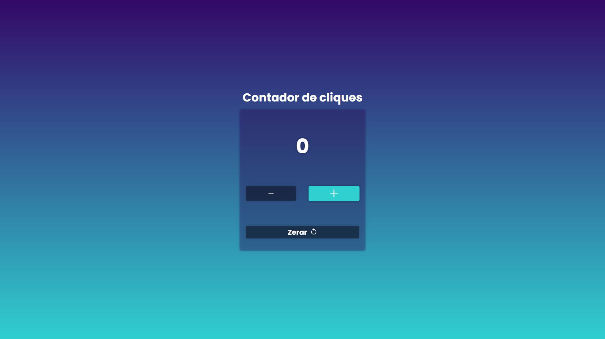

# Contador de Cliques

Um simples contador de cliques desenvolvido em HTML, CSS e JavaScript.

## Funcionalidades

- Aumentar o contador clicando no botão "+"
- Diminuir o contador clicando no botão "-"
- Zerar o contador clicando no botão "Zerar"

## 🖼️ Pré-visualização

## Veja em Ação

[Clique aqui para ver o contador em ação](https://codeclayton.github.io/Contador-Js/)
